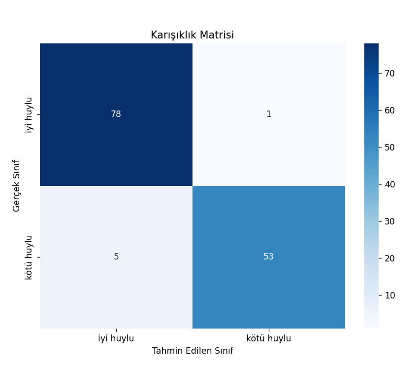
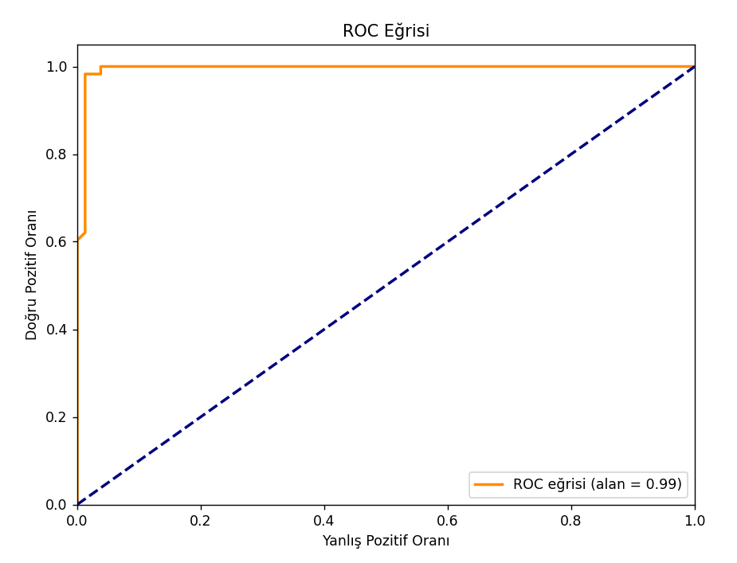
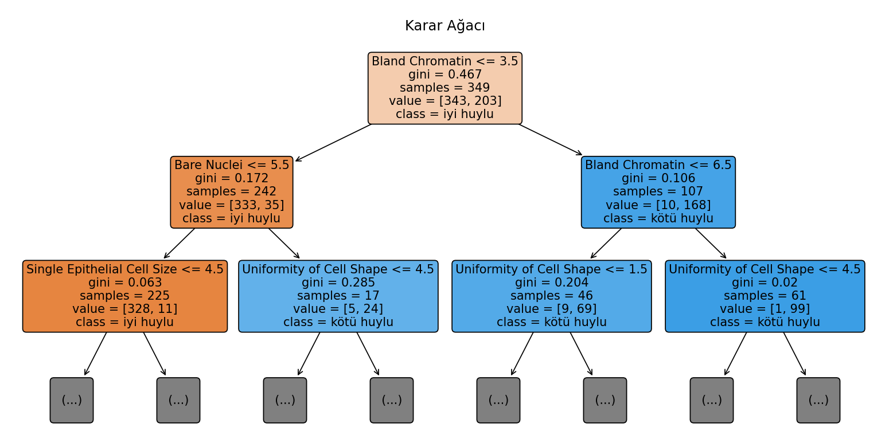
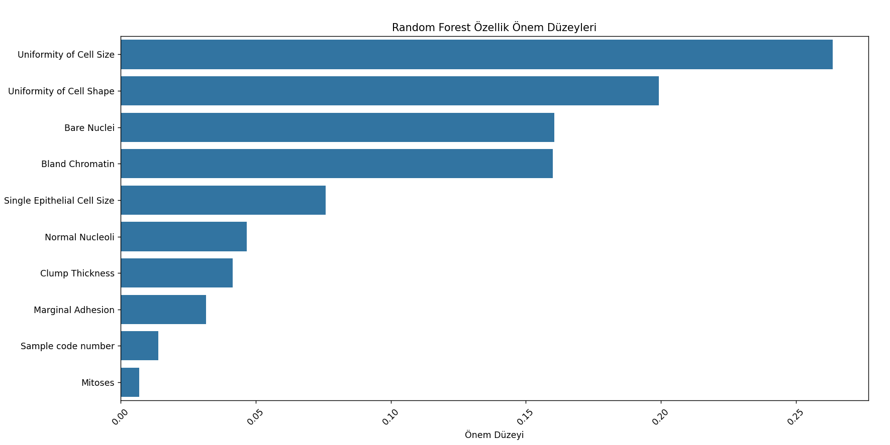

# Kanser Teşhisi ve Sınıflandırması

 

## Türkçe

- [Giriş](#Giriş)
- [Özellikler](#Özellikler)
- [Grafikler](#Grafikler)
- [Kullanılan Kütüphaneler](#Kullanılan-Kütüphaneler)
- [Emeği Geçenler](#Emeği-Geçenler)

### Giriş
Bu projede, göğüs kanseri teşhisi ve sınıflandırması için makine öğrenmesi yöntemlerinden biri olan Random Forest (Rastgele Orman) algoritması kullanılmıştır. Amaç, verilen hasta özelliklerine dayanarak tümörün iyi huylu mu yoksa kötü huylu mu olduğunu tahmin etmektir.

Veri kümesi olarak Wisconsin Üniversitesi tarafından toplanan "Wisconsin Göğüs Kanseri Veri Seti" kullanılmıştır. Bu veri seti, 569 hastadan alınan hücre çekirdeği özelliklerini içermektedir. Her bir hasta örneği için 30 farklı özellik (örneğin, hücre yarıçapı, doku kalınlığı, simetri) ve tümörün sınıfı (iyi huylu veya kötü huylu) bilgisi bulunmaktadır.

### Özellikler
* [Doğruluk (Accuracy)](#Doğruluk-Accuracy)
* [F1 Skoru](#F1-Skoru)
* [Hassasiyet (Precision)](#Hassasiyet-Precision)
* [Geri Çağırma (Recall)](#Geri-Çağırma-Recall)

#### Doğruluk (Accuracy)
Modelimizin doğruluk oranı %95.62 olarak hesaplanmıştır.

#### F1 Skoru
Modelimizin F1 skoru %94.64'tür.

#### Hassasiyet (Precision)
Modelimizin kötü huylu tümörleri doğru tespit etme oranı %98.0'dır.

#### Geri Çağırma (Recall)
Modelimizin tüm kötü huylu tümörleri yakalama oranı %92.0'dır.

### Grafikler
* [Karışıklık Matrisi](#Karışıklık-Matrisi)
* [ROC Eğrisi](#ROC-Eğrisi)
* [Karar Ağacı](#Karar-Ağacı)
* [Özellik Önem Düzeyleri](#Özellik-Önem-Düzeyleri)

#### Karışıklık Matrisi

#### ROC Eğrisi

#### Karar Ağacı

#### Özellik Önem Düzeyleri

### Kullanılan Kütüphaneler
* pandas
* sklearn
* matplotlib
* seaborn

### Emeği Geçenler
* Adem Mert Sedef
* Efe Abagünay
* Emirhan Duyan
* Furkan Kül
* Yunus Emre Kuru

## English

- [Introduction](#Introduction)
- [Features](#Features)
- [Visualizations](#Visualizations)
- [Libraries Used](#Libraries-Used)
- [Contributors](#Contributors)

### Introduction
In this project, the Random Forest algorithm, a machine learning method, is used for breast cancer diagnosis and classification. The goal is to predict whether a tumor is benign or malignant based on the given patient features.

The dataset used is the "Wisconsin Breast Cancer Dataset" collected by the University of Wisconsin. This dataset contains features of cell nuclei from 569 patients. Each patient sample includes 30 different features (e.g., cell radius, texture thickness, symmetry) and the tumor class (benign or malignant).

### Features
* [Accuracy](#Accuracy)
* [F1 Score](#F1-Score)
* [Precision](#Precision)
* [Recall](#Recall)

#### Accuracy
The accuracy of our model is calculated as 95.62%.

#### F1 Score
The F1 score of our model is 94.64%.

#### Precision
The precision for detecting malignant tumors is 98.0%.

#### Recall
The recall for detecting all malignant tumors is 92.0%.

### Visualizations
* [Confusion Matrix](#Confusion-Matrix)
* [ROC Curve](#ROC-Curve)
* [Decision Tree](#Decision-Tree)
* [Feature Importance](#Feature-Importance)

#### Confusion Matrix

#### ROC Curve

#### Decision Tree

#### Feature Importance

### Libraries Used
* pandas
* sklearn
* matplotlib
* seaborn

### Contributors
* Adem Mert Sedef
* Efe Abagünay
* Emirhan Duyan
* Furkan Kül
* Yunus Emre Kuru
